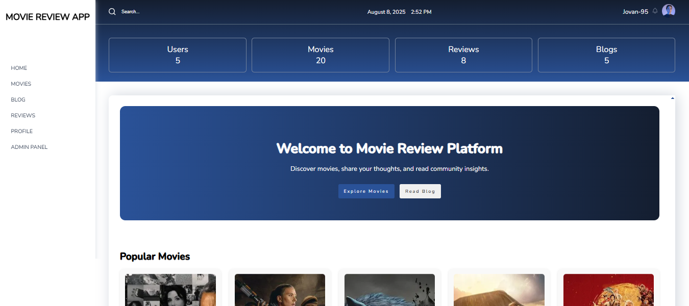
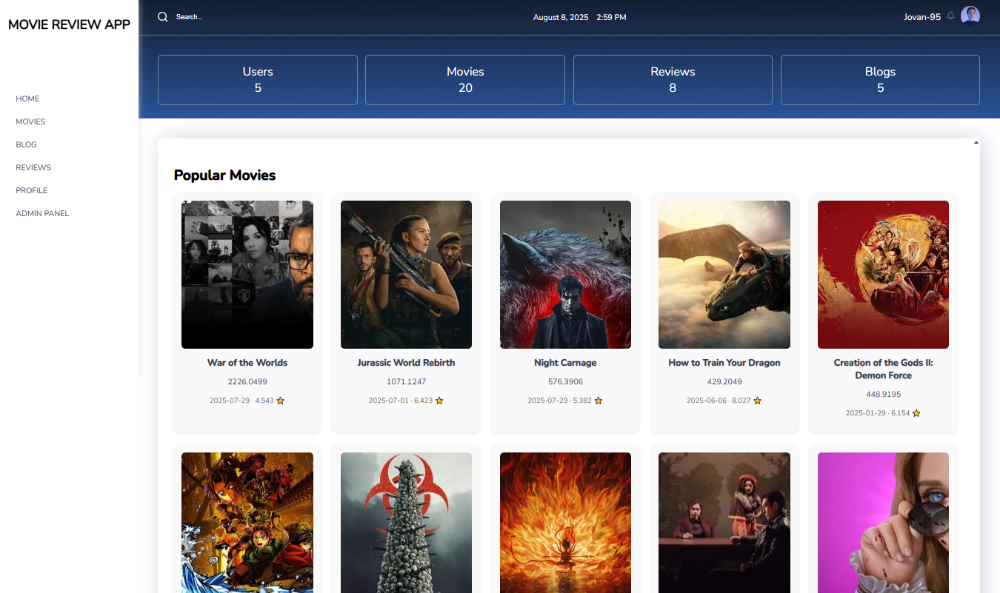
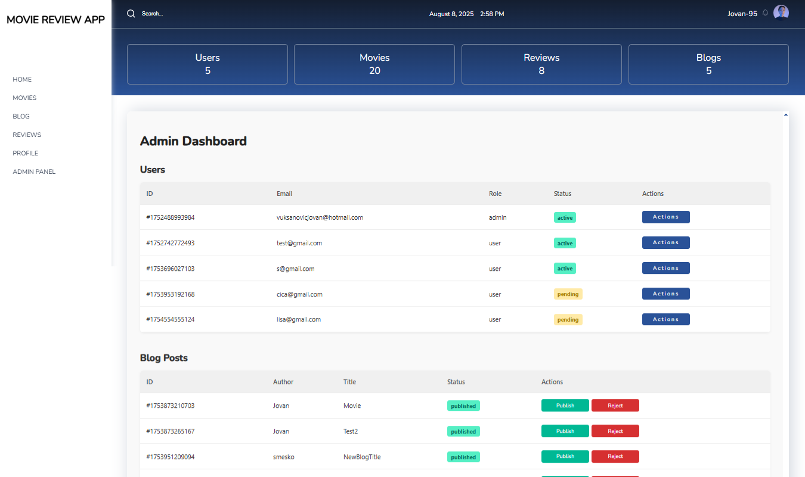

# 🎬 Movie Review Platform

A full-featured **React** application for discovering movies, reading reviews, posting comments, managing blogs, and controlling content through an **Admin Panel**.  
This app includes **authentication**, **role-based access control**, **search across the whole app**, and **real-time notifications**.

---

## 🚀 Features

- 🔐 **Authentication** – User registration, login, and role-based access (User / Admin)
- 📝 **Movie Reviews** – Add, edit, and delete movie reviews
- 💬 **Comments** – Comment on movies and blog posts
- 📖 **Blogs** – Read and manage blog articles
- 🗂 **Admin Panel** – Approve, reject, or ban users; manage movies, blogs, and reviews
- 🔍 **Global Search** – Search through movies, blogs, reviews, and users from anywhere in the app
- 🔔 **Toast Notifications** – Real-time feedback for actions
- 🎯 **Filtering & Sorting** – Easily find the content you want
- 📱 **Responsive Design** – Works seamlessly on desktop and mobile

---

## 🛠 Tech Stack

- **Frontend:** React, React Router, Redux Toolkit, React Query, Tailwind CSS
- **Backend:** JSON Server (local `db.json` for mock API)
- **Other Tools:** React Toastify for notifications

---

## 📸 Screenshots

### 🏠 Home Page



### 🎬 Movies Page



### 📖 Blog Section



### 🗂 Admin Panel


---

## 📦 Installation & Setup

```bash
# 1️⃣ Clone the repository
git clone https://github.com/your-username/movie-review-platform.git
```
